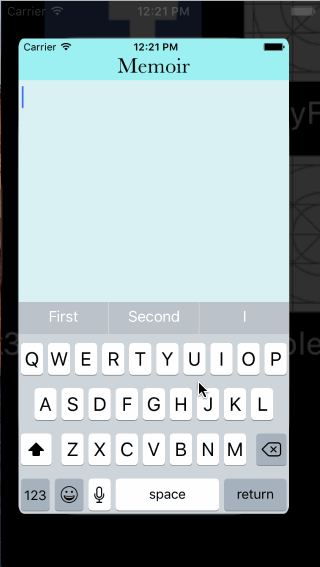
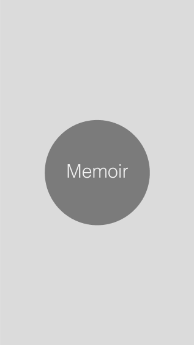
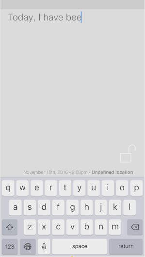
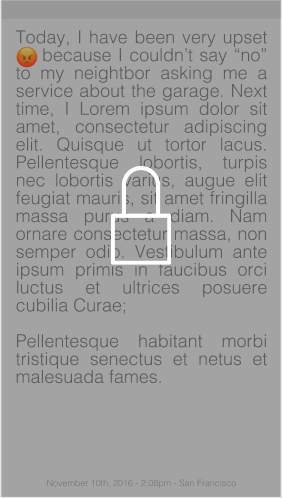
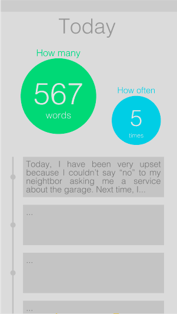
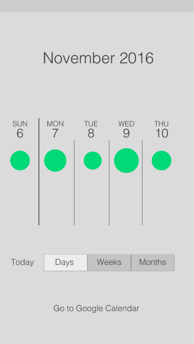
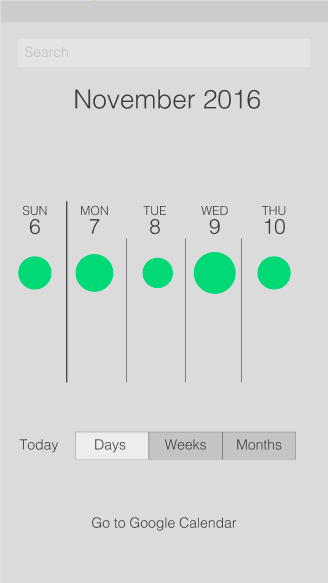
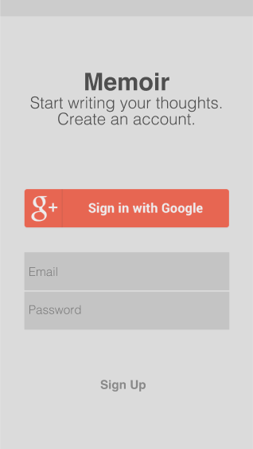
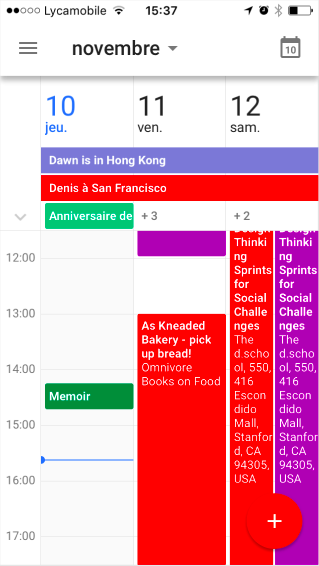
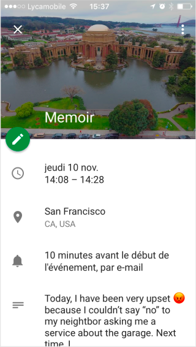

# Group Project: *Memoir*

**Memoir** has been programmatically animated with Swift (iOS) as a team project for [CodePath iOS for Designers](http://codepath.com/iosfordesigners).

### Team members
[**Monith Ilavarasan**](https://github.com/Monith)

[**Sindhuja Narasimhan**](https://github.com/sindunarasimhan)

[**Sophia Kecir Camper**](https://github.com/sophiakc)

### App Description
Personal diary attached to my calendar, using Google calendar API and a native calendar.

### Most up to date GIF of app

### Wireframes W3

### Wireframes W4

.png)

### User Stories
* [ ] 1. "Start Writing" View Controller (initial View Controller)
    * [ ] As a user I want to immediately come in and begin taking notes
        * [X] Automatically Select Text field and toggle keyboard when view loaded - Sophia
        * [X] If I swipe right, then the text is recorded and stored in an array - Monith
		* [ ] This text is also stored using NSDefaults so that it is persistent through user sessions - Namrata
		* [ ] Once I swipe right there are three indications that the text has been stored:
			* [X] The view controller and header change colors - Monith
			* [ ] There is a small animation that pops up briefly notifying the user that the text has been stored
			* [ ] Text animates off screen (flies off right)

* [ ] 2. Animation from any "Read Only" VC to the corresponding "Today" VC
    * [X] UI Pan Gesture down reveals "Today" VC - Namrata
	* [X] UI Swipe Gesture down reveals "Today" VC - Monith
    * [ ] The Read only text saved/stored in local app array/single user mode(not on network/multiple user) using NSdefaults - Namrata (ongoing)
    * [ ] The Read only text shrink into the Today small bubble view within the timeline - Namrata (ongoing)
    * [X] The number in the big bubbles updates based on the actual number of words written - Namrata
    * [X] The number in the big bubbles updates based on the actual number of times a text has been written during the same day - Namrata

* [ ] 5. "Today" View Controller
    * [X] Table view embedded in controller that allows us to see the text written - Monith
	* [X] Text also has time written attached to it - Monith
	* [X] Color scheme is consistent with previous notes view controller - Monith
    * [ ] Clicking on a cell gives a view of the full text written on that day
	* [ ] Swiping right pulls in the "This Week" View Controller
    * [X] Add TableViewController and cell and text label for NotesText list/array - Namrata
    * [X] Compute and store the number in the big bubbles (nb of words, nb of times) - Namrata
    * [ ] Get stored notesText from ReadVC and HomeVC using NSdefaults - Namrata (ongoing)
 
* [ ] 6. Animation from "Today" VC to "This Week" VC
	* [ ] UI Pan Gesture right goes to "This Week" VC
	* [ ] UI Swipe Gesture right goes to "This Week" VC - Monith
	* [ ] The big bubbles from Today shrink into smaller bubbles on the Week timeline table

* [ ] 7. "This Week" View Controller
    * [ ] Horizontal UIScrollView to see the different days of the month
    * [ ] Pan down to reveal search
    * [ ] from day to week view: shrink 7 columns into 1
    * [ ] from day to month view: shrink 30 columns into 1
    * [ ] from week to month view: shrink 4 columns into 1

* [ ] 8.Settings
    * [ ] Set up local time and location based on actual dataset up local time and location based on actual data
    * [ ] see where else to give access to it?

* [ ] 9. Launch screen
	* [ ] add and animate logo

## Video Walkthrough

## Notes / Challenges encountered while building the app:

## License

    Copyright [2016] Memoir

    Licensed under the Apache License, Version 2.0 (the "License");
    you may not use this file except in compliance with the License.
    You may obtain a copy of the License at

        http://www.apache.org/licenses/LICENSE-2.0

    Unless required by applicable law or agreed to in writing, software
    distributed under the License is distributed on an "AS IS" BASIS,
    WITHOUT WARRANTIES OR CONDITIONS OF ANY KIND, either express or implied.
    See the License for the specific language governing permissions and
    limitations under the License.
